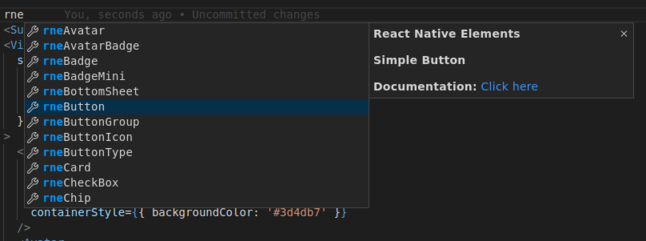

# React Native Elements Snippets

 [](https://github.com/semantic-release/semantic-release)



**Note:** There are two ways to insert these:

- **Trigger Suggest** (<kbd>⌃</kbd><kbd>Space</kbd> on macOS) and then type in the name; or you can
  enable the **Editor: Tab Completion** setting, then type the name of the
  snippet and press <kbd>Tab</kbd>.

## Features

- Works in JS/X and TSX
- Automatically adds missing imports when a snippet is inserted (as long as it succeeds in parsing the entire file)
- Supports `React Native Elements Universe` Package

## Installation

As in any Visual Studio Code Extension you have several options to install:

- Enter the Visual Studio Code Marketplace, search for `React Native Elements Snippets` (or enter directly on the extension page) and click on Install button.

- Inside Visual Studio Code, enter in the Extension panel, search for `React Native Elements Snippets` and click on Install button

- Run the following command in the Command Palette:

> ext install rne.snippets

## Snippets

<!-- snippets -->

- [`rneAvatar`](#rneavatar)
- [`rneAvatarBadge`](#rneavatarbadge)
- [`rneBadge`](#rnebadge)
- [`rneBadgeMini`](#rnebadgemini)
- [`rneBottomSheet`](#rnebottomsheet)
- [`rneButton`](#rnebutton)
- [`rneButtonGroup`](#rnebuttongroup)
- [`rneButtonIcon`](#rnebuttonicon)
- [`rneButtonType`](#rnebuttontype)
- [`rneCard`](#rnecard)
- [`rneCheckBox`](#rnecheckbox)
- [`rneChip`](#rnechip)
- [`rneChipIcon`](#rnechipicon)
- [`rneDivider`](#rnedivider)
- [`rneFAB`](#rnefab)
- [`rneIcon`](#rneicon)
- [`rneImage`](#rneimage)
- [`rneLinearProgress`](#rnelinearprogress)
- [`rneLinearProgressIndeterminate`](#rnelinearprogressindeterminate)
- [`rneRadio`](#rneradio)
- [`rneSearchBar`](#rnesearchbar)
- [`rneSlider`](#rneslider)
- [`rneSpeedDial`](#rnespeeddial)
- [`rneSpeedDialAction`](#rnespeeddialaction)
- [`rneText`](#rnetext)
- [`rneuCircularSlider`](#rneucircularslider)

### `rneAvatar`

#### Avatar Component

```javascript
<Avatar  title="$0" size="${1|small,medium,large,xlarge|}" rounded={${2|true,false|}}/>
```

### `rneAvatarBadge`

#### Avatar with Badge Component

```javascript
<View>
  <Avatar
    source={{
      uri: "$1",
    }}
    size="${2|small,medium,large,xlarge|}"
  />
  <Badge
    status="${3|success,error,primary,warning|}"
    containerStyle={{ position: "absolute", top: -4, right: -4 }}
  />
</View>
```

### `rneBadge`

#### Badge Component

```javascript
<Badge value="$1" status="${2|success,error,primary,warning|}" $0 />
```

### `rneBadgeMini`

#### Mini Badge Component

```javascript
<Badge status="${1|success,error,primary,warning|}" />
```

### `rneBottomSheet`

#### Bottom Sheet Component

```javascript
<BottomSheet isVisible={$1} containerStyle={{ backgroundColor: "$2" }}>
  $0
</BottomSheet>
```

### `rneButton`

#### Simple Button Component

```javascript
<Button onPress={$1} title={$2} $0 />
```

### `rneButtonGroup`

#### Button Group Component

```javascript
<ButtonGroup onPress={$1} selectedIndex={$2} buttons={[$3]} />
```

### `rneButtonIcon`

#### Button with Icon Component

```javascript
<Button
    onPress={$1}${2:
    iconPosition="${3|left,right,bottom,top|}"}
    icon={{name:'$4',color:'$5'}}
    title={$6}
 $0/>
```

### `rneButtonType`

#### Button with types Component

```javascript
<Button onPress={$1} type="${2|solid,clear,outline|}" title={$3} $0 />
```

### `rneCard`

#### Basic Card Component

```javascript
<Card>
  <Card.Title>$1</Card.Title>
  ${2:
  <Card.Divider/>}
  <Card.Image source={$3}>
   ${4:
    <Text style={{marginBottom: 10}}>
    $5
    </Text>
    }
        $6
  </Card.Image>
</Card>
```

### `rneCheckBox`

#### CheckBox Component

```javascript
<CheckBox
  title="$1"
  iconType="${2|material,material-community,simple-line-icon,zocial,font-awesome,octicon,ionicon,foundation,evilicon,entypo,antdesign,font-awesome-5|}"
  checkedIcon="$3"
  uncheckedIcon="$4"
  checkedColor="$5"
  checked={$6}
/>
```

### `rneChip`

#### Simple Chip Component

```javascript
<Chip title="$1" type="${2|solid,outline|}" />
```

### `rneChipIcon`

#### Chip with Icon Component

```javascript
<Chip
  title="$1"
  type="${2|solid,outline|}"
  icon={{
    name: "$3",
    type: "$4",
    color: "$5",
  }}
/>
```

### `rneDivider`

#### Divider Component

```javascript
<Divider />
```

### `rneFAB`

#### Floating Action Button Component

```javascript
<FAB title="$1" placement="${2|left,right|}" size="${3|small,large|}" $0 />
```

### `rneIcon`

#### Icon Component

```javascript
<Icon
  name="$1"
  type="${2|material,material-community,simple-line-icon,zocial,font-awesome,octicon,ionicon,foundation,evilicon,entypo,antdesign,font-awesome-5|}"
  size={$3}
  color="$4"
  $0
/>
```

### `rneImage`

#### Image Component

```javascript
<Image
  source={{ uri: '$1' }}
  style={{ width: $2, height: $3 }}
  ${4:PlaceholderContent={$5}}
/>
```

### `rneLinearProgress`

#### Linear Progress Component

```javascript
<LinearProgress
  color="${1|primary,secondary|}"
  variant="determinate"
  value={$2}
  $0
/>
```

### `rneLinearProgressIndeterminate`

#### Linear Progress indeterminate variant Component

```javascript
<LinearProgress color="${1|primary,secondary|}" $0 />
```

### `rneRadio`

#### CheckBox Component

```javascript
<CheckBox
  title="$1"
  iconType="material"
  checkedIcon="radio-button-checked"
  uncheckedIcon="radio-button-unchecked"
  checkedColor="$2"
  checked={$3}
/>
```

### `rneSearchBar`

#### Search Bar Component

```javascript
<SearchBar placeholder="$1" onChangeText={$2} value={$3} $0 />
```

### `rneSlider`

#### Slider Component

```javascript
<Slider
  value={$1}
  onValueChange={$2}
  maximumValue={$3}
  minimumValue={$4}
  thumbProps={{ $5 }}
/>
```

### `rneSpeedDial`

#### Speed Dial Wrapper Component

```javascript
<SpeedDial
  isOpen={$1}
  onOpen={$2}
  onClose={$3}
  icon={{ name: "$4" }}
  openIcon={{ name: "$5" }}
>
  $0
</SpeedDial>
```

### `rneSpeedDialAction`

#### Speed Dial Action Component

```javascript
<SpeedDial.Action icon={{ name: "$1" }} title="$2" onPress={$3} />
```

### `rneText`

#### Text Component

```javascript
<Text ${1|h1,h2,h3,h4,h5,h6|} $1styles={{$2}}>
    $0
</Text>
```

### `rneuCircularSlider`

#### Universal Circular Slider Component

```javascript
<CircularSliderUniverse value={$1} onChange={$2} showThumbText />
```

<!-- snippetsend -->
